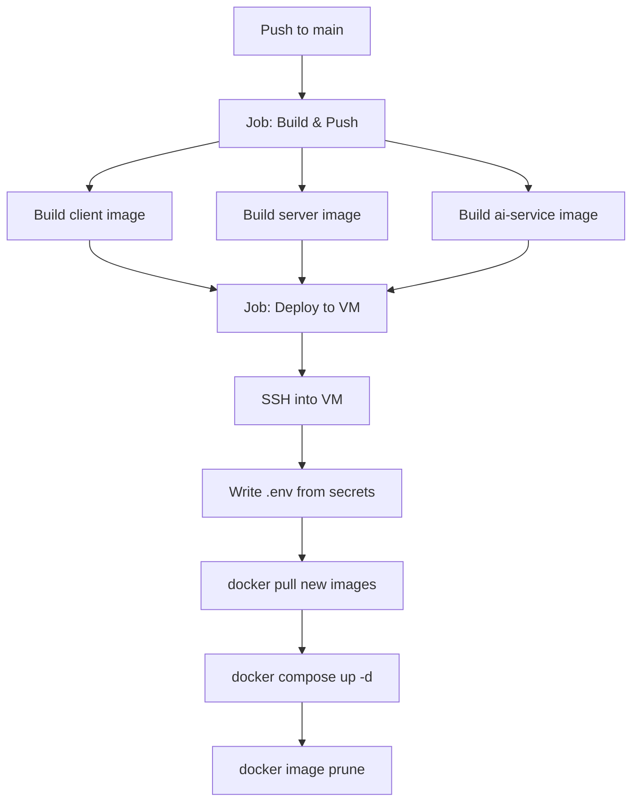

# CI/CD Setup Guide — Codebase Chat Assistant

## What Was Created

| File | Purpose |
|---|---|
| [.github/workflows/deploy.yml](file:///d:/Projects/Codebase%20Chat%20Assistant/.github/workflows/deploy.yml) | GitHub Actions workflow |
| [docker-compose.yml](file:///d:/Projects/Codebase%20Chat%20Assistant/docker-compose.yml) | Updated with image override support |

---

## How the Pipeline Works



### On every **push to `main`**:
1. **Build** — All 3 images are built in parallel via matrix strategy and pushed to Docker Hub with two tags: `:latest` and `:<commit-sha>`
2. **Deploy** — SSH into your VM, write the `.env`, pull the exact SHA-tagged images, and bring up the stack with `docker compose up -d`

### On **pull requests**:
- Images are built (to catch errors early) but **not pushed** and **not deployed**

---

## Required GitHub Secrets

Go to **GitHub → Your Repo → Settings → Secrets and variables → Actions → New repository secret** and add:

| Secret Name | Value |
|---|---|
| `DOCKERHUB_USERNAME` | Your Docker Hub username |
| `DOCKERHUB_TOKEN` | Docker Hub access token (not your password) |
| `SSH_PRIVATE_KEY` | Contents of `~/.ssh/id_rsa` (private key for your VM) |
| `VM_HOST` | Your VM's public IP address (e.g. `64.227.169.180`) |
| `VM_USER` | SSH username (e.g. `root` or `ubuntu`) |
| `MONGODB_URI` | Full MongoDB Atlas connection string |
| `JWT_SECRET` | Your JWT secret key |
| `GOOGLE_API_KEY` | Your Google Gemini API key |

> [!TIP]
> Generate a Docker Hub access token at: https://hub.docker.com/settings/security

---

## VM Prerequisites

Run these **once** on your VM to set it up:

```bash
# 1. Install Docker
curl -fsSL https://get.docker.com | sh

# 2. Install Docker Compose plugin (v2)
apt-get install -y docker-compose-plugin

# 3. Add your SSH public key to authorized_keys
#    (copy the output of this from your local machine)
cat ~/.ssh/id_rsa.pub
# Then on the VM:
echo "YOUR_PUBLIC_KEY_HERE" >> ~/.ssh/authorized_keys

# 4. Create the app directory
mkdir -p ~/codebase-chat-assistant
```

---

## Docker Hub Image Names

After the first successful run, your images will be at:

| Service | Image |
|---|---|
| Client | `<your-username>/codebase-chat-assistant-client:<sha>` |
| Server | `<your-username>/codebase-chat-assistant-server:<sha>` |
| AI Service | `<your-username>/codebase-chat-assistant-ai-service:<sha>` |

---

## Local Development (Unchanged)

The `docker-compose.yml` changes are **backward compatible**. When `CLIENT_IMAGE`, `SERVER_IMAGE`, and `AI_SERVICE_IMAGE` are not set (normal local `docker compose up`), Docker Compose falls back to building from local Dockerfiles as before.

```bash
# Local dev — works exactly as before
docker compose up --build
```

---

## Ports Exposed on the VM

| Service | VM Port |
|---|---|
| Client (React/Nginx) | `3000` |
| Server (Express API) | `5000` |
| AI Service (FastAPI) | `8400` |
| ChromaDB | `8000` |

> [!IMPORTANT]
> Make sure your VM's firewall/security group allows inbound TCP on ports **3000, 5000, 8400** from the internet.
